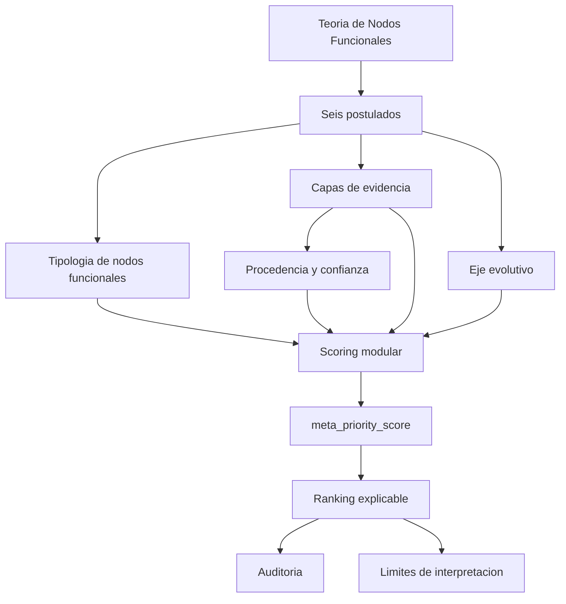

# Theory Software Alignment

El diagrama resume la dependencia conceptual: el software no define la teoria;
la teoria define que capas, variables, scores, advertencias y auditorias debe
producir el software.
