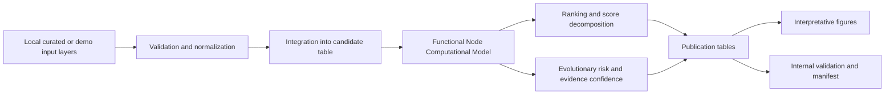

# Manuscript Figures

The figures in `results/publication_package/figures/` are generated from consolidated local publication tables. They are descriptive visualizations of reproducible computational demonstration outputs.

## Figure 0. Nodos Functional Workflow and Publication Package Generation

Interpretation: the workflow shows how local evidence layers become auditable publication outputs. It should be used as a conceptual software workflow, not as evidence of biological confirmation.

## Figure 1. Top Candidates by Meta Priority

- File: `results/publication_package/figures/figure_1_top_candidates_meta_priority.png`
- Data source: `publication_table_1_top_candidates.csv`
- Main message: ranked candidate functional nodes ordered by `meta_priority_score`.
- Manuscript interpretation: primary visual summary of the computational ranking.

## Figure 2. Therapeutic Priority vs Evidence Confidence

- File: `results/publication_package/figures/figure_2_priority_vs_confidence.png`
- Data source: `publication_table_1_top_candidates.csv`
- Main message: `therapeutic_priority_score` and `evidence_confidence_score` are separate outputs.
- Manuscript interpretation: supports cautious reading of high-priority candidates with their evidence confidence.

## Figure 3. Score Decomposition by Candidate

- File: `results/publication_package/figures/figure_3_score_decomposition.png`
- Data source: `publication_table_2_score_decomposition.csv`
- Main message: therapeutic priority, evidence confidence, functional node score and evolutionary escape risk can be inspected together.
- Manuscript interpretation: shows that the model is decomposable and not a black box.

## Figure 4. Evolutionary Risk vs Therapeutic Priority

- File: `results/publication_package/figures/figure_4_evolutionary_risk_vs_priority.png`
- Data source: `publication_table_1_top_candidates.csv`
- Main message: evolutionary risk can be reviewed alongside therapeutic priority.
- Manuscript interpretation: highlights candidates where priority may require additional caution because of escape risk.

## Figure 5. Ranking Stability

- File: `results/publication_package/figures/figure_5_ranking_stability.png`
- Data source: `publication_table_4_sensitivity_stability.csv`
- Main message: maximum absolute rank movement summarizes sensitivity of candidate ordering.
- Manuscript interpretation: supports internal validation of ranking behavior under configured scenarios.

## Figure 6. Therapeutic Role Distribution

- File: `results/publication_package/figures/figure_6_therapeutic_role_distribution.png`
- Data source: `publication_table_1_top_candidates.csv`
- Main message: candidate counts by therapeutic role.
- Manuscript interpretation: summarizes how the current result set is classified across bactericidal, antivirulence, sensitizer, mixed strategy, low priority or other available roles.

## Conservative Interpretation

All figures are computational demonstration outputs. They should be interpreted as visual support for prioritized hypotheses requiring independent validation.
