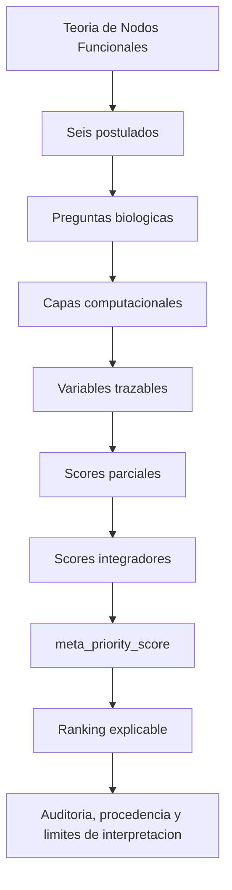
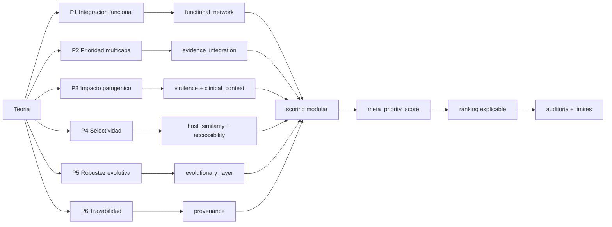

# Theory to Software Mapping

## Cadena conceptual

## Mapeo formal

| Postulado teorico | Pregunta biologica | Capa computacional | Variables implementadas | Score relacionado | Archivo donde se implementa | Estado | Comentarios |
|---|---|---|---|---|---|---|---|
| Integracion funcional del nodo | El candidato actua como nodo funcional o como entidad aislada? | `functional_network`, `redundancy`, `contextual_essentiality` | `network_centrality`, `pathway_bottleneck_score`, `functional_dependency_score`, `redundancy_penalty`, `functional_module`, `module_bridge` si la fuente los aporta | `functional_node_score`, `functional_node_theory_score` | `src/nodos_funcionales/scoring.py`, `src/nodos_funcionales/functional_node_theory.py`, `src/nodos_funcionales/integration.py` | parcial | La red funcional ya existe; degree/betweenness/module_bridge dependen de fuentes externas o datos del usuario. |
| Prioridad terapeutica multicapa | La prioridad surge por convergencia de capas o por una sola metrica? | `evidence_integration`, `layer_resolution`, `evidence_quality` | `evidence_confidence_score`, `evidence_coverage_score`, `confidence_source_class`, `confidence_evidence_tier`, `optional_data_quality_score`, `layer_support` derivado | `meta_priority_score`, `confidence_modifier` | `src/nodos_funcionales/scoring.py`, `src/nodos_funcionales/phase3_evidence.py`, `src/nodos_funcionales/layer_resolver.py` | implementado parcial | Se refuerza con alias teoricos y descomposicion de prioridad. |
| Impacto patogenico | Perturbar el nodo puede reducir supervivencia, virulencia, persistencia, adaptacion o dano? | `essentiality`, `virulence`, `clinical_impact`, `curated_disease_context`, `contextual_essentiality` | `essential`, `virulence_score`, `host_damage_score`, `clinical_impact_score`, `infection_context_score`, `contextual_essentiality_score`, `biofilm_escape_penalty` | `antibiotic_target_score`, `antivirulence_target_score`, `clinical_context_score` | `src/nodos_funcionales/scoring.py`, `src/nodos_funcionales/contextual_essentiality.py`, `src/nodos_funcionales/virulence_layers.py` | implementado parcial | Persistencia y adaptacion se representan por contexto, biofilm, estres y fase 3 cuando hay datos. |
| Selectividad terapeutica | El nodo parece mas importante para el patogeno que riesgoso para el hospedero? | `human_homologs`, `host_annotation`, `localization`, `therapy_site_context` | `human_homolog`, `domain_overlap_score`, `host_criticality_penalty`, `host_safety_score`, `localization`, `infection_site_access_score`, `physical_accessibility` | `selectivity_score`, `antibiotic_target_score`, `antivirulence_target_score` | `src/nodos_funcionales/scoring.py`, `src/nodos_funcionales/human_essentiality_api.py`, `src/nodos_funcionales/uniprot_api.py` | implementado parcial | `selectivity_score` es alias auditable de seguridad/host risk, no validacion toxicológica. |
| Robustez evolutiva y restriccion del escape | El nodo deja poco espacio evolutivo de escape? | `evolutionary_escape_risk`, `evolutionary_escape`, `redundancy`, `strain_conservation`, `functional_network` | `evolutionary_escape_risk_score`, `evolutionary_constraint_score`, `mutation_tolerance_score`, `functional_redundancy_escape_score`, `paralog_count`, `mobile_context`, `hgt_context`, `recombination_context`, `resistance_association` | `evolutionary_robustness_score`, `reduced_evolutionary_space_score` | `src/nodos_funcionales/evolutionary_escape_risk.py`, `src/nodos_funcionales/evolutionary_escape.py`, `src/nodos_funcionales/redundancy_analysis.py` | implementado parcial | Si faltan datos locales, la capa debe reportar incertidumbre; ausencia no es evidencia negativa. |
| Trazabilidad, incertidumbre y no sobreinterpretacion | De donde viene cada senal y que tanto debe confiarse en ella? | `provenance`, `online_sources`, `curated_snapshots`, `layer_resolution` | `source_type`, `source_name`, `retrieval_status`, `retrieval_mode`, `cache_status`, `evidence_source`, `evidence_level`, `confidence`, `provenance_status` | `confidence_modifier`, `confidence_ceiling`, `evidence_quality_score` | `src/nodos_funcionales/layer_resolver.py`, `src/nodos_funcionales/generic_annotation_import.py`, `src/nodos_funcionales/reporting.py` | implementado parcial | La jerarquia conceptual se documenta y se agrega como salida por candidato. |

## Diagrama de flujo ampliado

